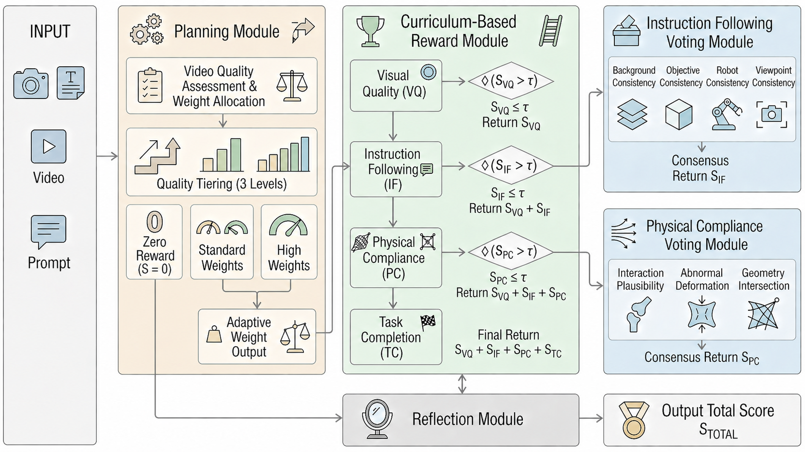
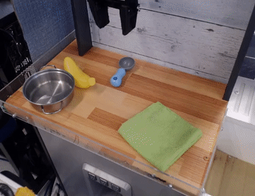
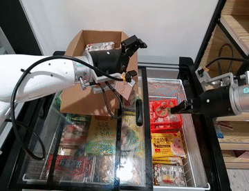
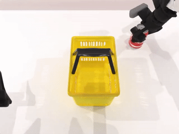

<h1 align="center">EWA-Reward</h1>

<p align="center">
  <strong>Embodied World-model Agent Reward</strong>
</p>

<p align="center">
  <a href="https://arxiv.org/abs/2606.19990">📄 Paper</a> |
  <a href="#quick-start">🚀 Quick Start</a> |
  <a href="#demo-videos">🎬 Demo</a> |
  <a href="#api">🧩 API</a> |
  <a href="#citation">📝 Citation</a>
</p>

---

EWA-Reward is the reward-agent implementation for
**Reward as an Agent for Embodied World Models**. It evaluates embodied robot
rollouts with an OpenAI-compatible multimodal LLM and streams one reward result
per video.

## News

- **2026-06-30**: Initial open-source release of the EWA-Reward service.

## Framework

<p align="center">
  
</p>

EWA-Reward centers on agentic visual reward judging:

- Planning-level quality gate for obviously failed generations.
- Vision quality scoring for clarity and brightness; the two checks are multiplied, so either failed check makes the vision score 0.
- Motion-quality metrics are reserved for future integration and are not included in the current score.
- Instruction-following and background-consistency scoring before final task-completion scoring.
- Standalone final task-completion reward for process and outcome consistency.
- OpenAI-compatible backend support, including vLLM-style chat completions.

## TODO

- Integrate more model-based rewards for embodied world-model evaluation.
- Add optional non-LLM motion-quality rewards after public dependency cleanup.

## Quick Start

Create an environment:

```bash
bash scripts/setup_env.sh
```

Or install into an existing Python 3.10+ environment:

```bash
python -m pip install -e .
```

Configure the model endpoint:

```bash
cp .env.example .env
```

Start the service:

```bash
bash scripts/run_ewa_reward.sh
```

Equivalent:

```bash
python -m ewa_reward.cli serve
```

After installation, the console command is available:

```bash
ewa-reward serve
ewa-reward --version
```

## Evaluation

Using the CLI:

```bash
python -m ewa_reward.cli eval \
  --url http://127.0.0.1:7024/eval_video \
  --prompt "A first-person dual-arm robot picks up the red cube and places it into the bowl." \
  --video /absolute/path/to/video_0.mp4 \
  --video /absolute/path/to/video_1.mp4
```

Using `curl`:

```bash
curl -N http://127.0.0.1:7024/eval_video \
  -H "Content-Type: application/json" \
  -d @examples/demo_01/request.json
```

Example streamed response:

```jsonl
{"index":0,"score":1.0,"status":"success"}
```

## Demo Videos

The repository includes five small demo rollouts under `examples/`:

| Demo | Preview | Reward output |
| --- | --- | --- |
| Cloth manipulation | [](examples/demo_01/video_1.mp4)<br>[MP4](examples/demo_01/video_1.mp4) | `{"index": 0, "score": 1.0, "status": "success"}` |
| Refrigerator drawer opening | [](examples/demo_02/video_1.mp4)<br>[MP4](examples/demo_02/video_1.mp4) | `{"index": 0, "score": 1.0, "status": "success"}` |
| Basket handle grasping | [](examples/demo_03/video_0.mp4)<br>[MP4](examples/demo_03/video_0.mp4) | `{"index": 0, "score": 0.7, "status": "success"}` |
| Green cube placing | [](examples/demo_04/video_0.mp4)<br>[MP4](examples/demo_04/video_0.mp4) | `{"index": 0, "score": 0.384, "status": "success"}` |
| Failed box relocation | [](examples/demo_05/video_0.mp4)<br>[MP4](examples/demo_05/video_0.mp4) | `{"index": 0, "score": 0, "status": "success"}` |

Prompt and request files:

| Demo | Prompt | Request |
| --- | --- | --- |
| Cloth manipulation | `examples/demo_01/prompt.txt` | `examples/demo_01/request.json` |
| Refrigerator drawer opening | `examples/demo_02/prompt.txt` | `examples/demo_02/request.json` |
| Basket handle grasping | `examples/demo_03/prompt.txt` | `examples/demo_03/request.json` |
| Green cube placing | `examples/demo_04/prompt.txt` | `examples/demo_04/request.json` |
| Failed box relocation | `examples/demo_05/prompt.txt` | `examples/demo_05/request.json` |

The demo results above were verified with the reward model served by vLLM using
`--max-model-len 65536`, which is required by the 64-frame physics/motion reward
stage:

```bash
# Activate an environment with vLLM installed, for example:
# conda activate your-vllm-env
export MODEL_PATH=/path/to/your/reward-model
CUDA_VISIBLE_DEVICES=3 python -m vllm.entrypoints.openai.api_server \
  --model "$MODEL_PATH" \
  --served-model-name "$MODEL_PATH" \
  --trust-remote-code \
  --host 127.0.0.1 \
  --port 7000 \
  --dtype bfloat16 \
  --gpu-memory-utilization 0.95 \
  --max-model-len 65536
```

Run them against a local service:

```bash
curl -N http://127.0.0.1:7024/eval_video \
  -H "Content-Type: application/json" \
  -d @examples/demo_01/request.json

curl -N http://127.0.0.1:7024/eval_video \
  -H "Content-Type: application/json" \
  -d @examples/demo_02/request.json

curl -N http://127.0.0.1:7024/eval_video \
  -H "Content-Type: application/json" \
  -d @examples/demo_03/request.json

curl -N http://127.0.0.1:7024/eval_video \
  -H "Content-Type: application/json" \
  -d @examples/demo_04/request.json

curl -N http://127.0.0.1:7024/eval_video \
  -H "Content-Type: application/json" \
  -d @examples/demo_05/request.json
```

## Configuration

Important variables:

```bash
EWA_REWARD_API_BASE=http://localhost:7000/v1
EWA_REWARD_API_KEY=dummy
EWA_REWARD_MODEL=/path/to/your/reward-model
EWA_REWARD_PORT=7024
EWA_REWARD_LOG_ROOT=./runs
```

| Variable | Example | Description |
| --- | --- | --- |
| `EWA_REWARD_API_BASE` | `http://localhost:7000/v1` | OpenAI-compatible `/v1` endpoint. |
| `EWA_REWARD_API_KEY` | `dummy` | Bearer token sent to the model server. |
| `EWA_REWARD_MODEL` | `/path/to/your/reward-model` | Model name/path passed in chat-completions requests. |
| `EWA_REWARD_HOST` | `0.0.0.0` | FastAPI bind host. |
| `EWA_REWARD_PORT` | `7024` | FastAPI bind port. |
| `EWA_REWARD_LOG_ROOT` | `./runs` | Directory for copied inputs and detailed judge logs. |
| `EWA_REWARD_SAVE_INPUTS` | `true` | Copy submitted videos and prompts into `EWA_REWARD_LOG_ROOT`. |
| `EWA_REWARD_LLM_TIMEOUT` | `600` | LLM request timeout in seconds. |
| `EWA_REWARD_MAX_RETRIES` | `10` | Maximum retry count for invalid or unparsable judge JSON. |
| `EWA_REWARD_ENABLE_MOTION_QUALITY` | `false` | Reserved for future non-LLM motion-quality rewards. |
| `EWA_REWARD_MOTION_QUALITY_PATH` | empty | Reserved path for future motion-quality integrations. |

## API

`GET /health`

Returns service configuration and optional metric availability:

```json
{
  "status": "ok",
  "model": "/path/to/your/reward-model",
  "motion_quality_enabled": false,
  "motion_quality_available": false
}
```

`POST /eval_video`

Request body:

```json
{
  "video_path": ["/absolute/path/to/video_0.mp4"],
  "prompt": "Task description shared by the videos."
}
```

Response: `application/jsonl`, one object per completed video:

```json
{"index": 0, "score": 1.0, "status": "success"}
```

## Repository Layout

```text
.
├── reward_main.py          # FastAPI service and reward pipeline
├── prompt.py               # LLM judge prompts
├── score_calc.py           # JSON-to-score reducers
├── ewa_reward/             # package modules
├── assets/                 # README figures
├── scripts/                # setup and launch scripts
├── examples/               # example request payloads
├── tests/                  # smoke tests for config, API, and helpers
└── pyproject.toml          # installable Python package metadata
```

## Development

```bash
python -m compileall ewa_reward reward_main.py prompt.py score_calc.py test_server.py tests
python -m pytest -q
python -m ewa_reward.cli --help
```

The repository includes a GitHub Actions workflow in `.github/workflows/ci.yml`
that runs these checks on Python 3.10 and 3.11.

If your global Python already has OpenCV installed against NumPy 1.x, importing
`cv2` with NumPy 2.x may fail. The provided dependencies pin `numpy<2`; rebuild
the environment with `bash scripts/setup_env.sh` if you hit an OpenCV/NumPy ABI
error while decoding videos.

## Citation

If this code helps your work, please cite the paper:

```bibtex
@misc{li2026rewardagentembodiedworld,
      title={Reward as An Agent for Embodied World Models}, 
      author={Pu Li and Zhigang Lin and Qiang Wu and Yongxuan Lv and Fei Wang and Shan You},
      year={2026},
      eprint={2606.19990},
      archivePrefix={arXiv},
      primaryClass={cs.AI},
      url={https://arxiv.org/abs/2606.19990}, 
}
```
